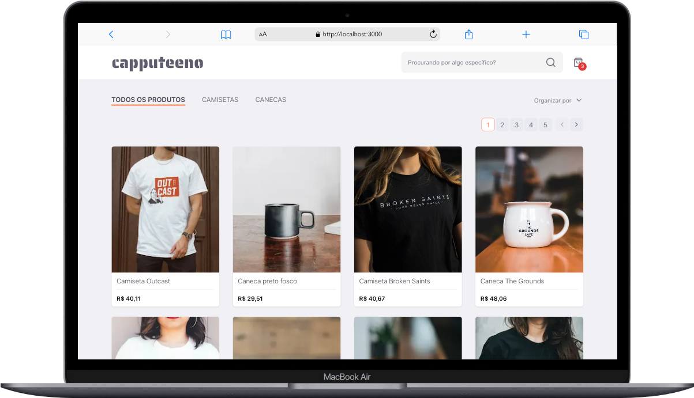
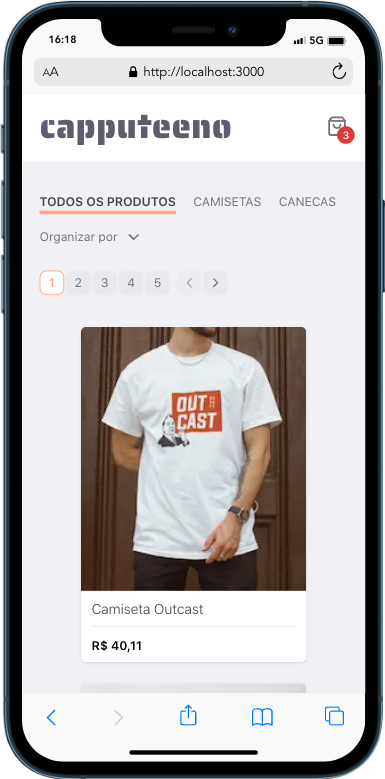

 <h1 align="center">🚀 Front end challenge 🚀</p>


# 🧠 Contexto

Bem-vindo(a). Este é o desafio Front end!

O objetivo deste desafio é avaliar suas habilidades de programação.
Quando sua solução estiver pronta, basta responder o e-mail que recebeu com o link do seu repo aqui no Github!
Em seguida, enviaremos o feedback e as instruções dos próximos passos!

Caso tenha alguma dúvida, nós estamos disponíveis no email *recrutamento@rocketseat.com.br*
Bom desafio!

> ⚠️ **É importante que o seu repo esteja público, caso contrário não iremos conseguir avaliar sua resposta**

O desafio será implementar um e-commerce para venda de canecas e camisetas que deverá ter as seguintes funcionalidades:
- [x] Catálogo de produtos com paginação
- [x] Filtragem produtos por categoria
- [x] Busca por nome do produto
- [x] Adicionar e remover produtos do carrinho
- [x] Finalizar compra

#

<h1 align="center">
    Capputeeno
</h1>

<p align="center">Next.js e-commerce for selling mugs and t-shirts</p>

<p align="center">
    <a href="https://github.com/gustavonobrega">
    
  </a>
</p>

### 💻 Desktop
<p align="center">
  
</p>

### 📱 Mobile
<p align="center">
  
</p>

<hr />

## 🚀 Technologies

This React app features all the latest tools and practices in web development!

- [ReactJS](https://reactjs.org/)
- [TypeScript](https://www.typescriptlang.org/)
- [Next.js](https://nextjs.org/)
- [Tailwind CSS](https://www.tailwindcss.com)
- [React Query](https://tanstack.com/query/latest/)
- [Radix](https://radix-ui.com/)
- [Axios](https://axios-http.com/)
- [Lucide Icons](https://lucide.dev/icons/)
- [React Hot Toast](https://react-hot-toast.com/)
- [Vitest](https://vitest.dev/)
- [Testing Library](https://testing-library.com/)
- [Playwright](https://playwright.dev/)


## 💻  Getting started

_Before you run this application make sure to copy the .env.example file, rename it to .env.local and add all the values for the environment variables._


#### Clone this repository
```bash
$ git clone https://github.com/gustavonobrega/capputeeno-challenge
```

#### Running the server
```bash
# Go into the repository
$ cd api

# Install dependencies
$ yarn

# Run the server
$ yarn start
```
#### Running the app

```bash

# Go into the repository
$ cd capputeeno

# Install dependencies
$ npm install

# Run the app
$ npm run dev
```
---

Made with ♥ by Gustavo Nobrega

